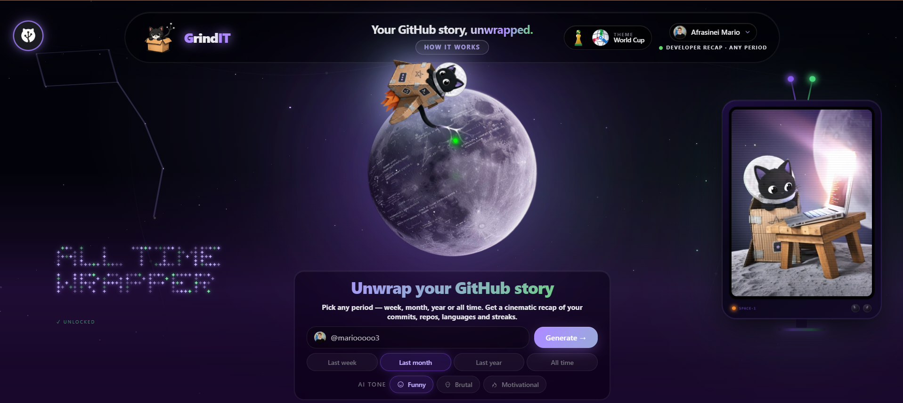

# GrindIT — Your GitHub Story, Unwrapped

> **All Rights Reserved.** Proprietary and confidential. Use, modification, or distribution without explicit written permission from the author is strictly prohibited.

---

**GrindIT** transforms your GitHub profile into a cinematic, shareable recap — like Spotify Wrapped, but for developers.

Enter your username, pick a time period, and get a personalized story of your coding journey presented as a sequence of animated slides.

---

## What's in your recap

- **Developer archetype** — discover your coding identity (Grinder, Polyglot Explorer, Code Poet, and more)
- **Contribution overview** — your commit activity, longest streak, and total impact at a glance
- **Language breakdown** — a visual chart of everything you've been coding in
- **Top repository** — your most significant project, highlighted
- **Coding journey** — your timeline and key milestones
- **Achievements & trophies** — badges earned through your work
- **AI narrative** — an optional AI-written story about your coding period, in the tone you choose

---

## How it works

1. Enter any GitHub username on the homepage
2. Choose a time period — last week, last month, last year, or all time
3. Pick an AI tone — **Funny**, **Brutal**, or **Motivational**
4. Hit **Generate** and watch your story unfold slide by slide
5. Download your stats card as a PNG or share it directly to X or LinkedIn

---

## Themes

Two completely different visual experiences to choose from:

| Space | World Cup |
|---|---|
| Violet · dark · cosmic | Amber · stadium lights · cat mascots |

Switch between them from the homepage before generating your recap.

---

## Share

Every slide can be captured and shared. The last slide generates a shareable stats card — save it as a PNG or post it directly to social media in one click.
