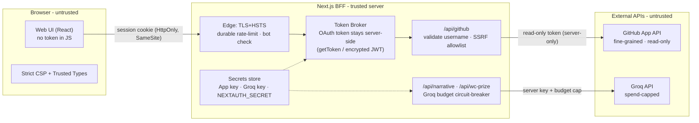

# Security Architecture — GitHub Wrapped

> **Status:** DRAFT · design only, not yet implemented.
> **Scope:** `github-wrapped` (Next.js 16 App Router, React 19, NextAuth, Groq).
> **Author:** Rareș · **Date:** 2026-06-20 · **Tracked on:** `security/architecture` (isolated from `main` feature work).

This document is a defensive security architecture: a threat model of the current
application, a prioritized list of the real attack surface (tied to the actual code),
and a target "defense in depth" architecture to harden it. It is the foundation for the
later phases — red team / penetration testing, incident response, and endpoint security.

---

## 1. Methodology & program

A phased security program:

| Phase | Goal | State |
|------|------|-------|
| **1. Threat model** | Map assets, trust boundaries, actors | ✅ this doc |
| **2. Architecture & hardening** | Define + implement defense-in-depth controls | ✅ design / ⏳ impl |
| **3. Red team / pentest** | Prove the findings via authorized testing | ⏳ planned |
| **4. Incident response** | Playbooks for the likely incidents | ⏳ planned |
| **5. Endpoint security** | Harden dev machines + CI | ⏳ planned |

Findings are mapped to the [OWASP Top 10 (2021)](https://owasp.org/Top10/) where relevant.

---

## 2. System overview

- **Frontend:** React 19 client components (landing, wrapped slides, World Cup theme).
- **Backend:** Next.js Route Handlers (`app/api/*`).
  - `app/api/auth/[...nextauth]` — GitHub OAuth via NextAuth (JWT sessions).
  - `app/api/github` — fetches GitHub data (REST + GraphQL).
  - `app/api/analyze` — pure-compute metrics/archetypes.
  - `app/api/narrative`, `app/api/wc-prize` — call the Groq LLM (cost-bearing).
- **External dependencies:** `api.github.com`, `api.groq.com`, `api.dicebear.com` (avatars).
- **Secrets:** `GITHUB_CLIENT_ID/SECRET`, `NEXTAUTH_SECRET`, `GROQ_API_KEY`, optional `GITHUB_TOKEN`.

---

## 3. Threat model

### 3.1 Assets

| # | Asset | Why it matters | Current state |
|---|-------|----------------|---------------|
| A1 | **GitHub OAuth access token** (scope `repo`) | `repo` = read **and write** to all private repos | **exposed to the browser** |
| A2 | `GROQ_API_KEY` | per-request cost → financial DoS | server-side ✅ |
| A3 | `GITHUB_TOKEN` server fallback | shared credential for anonymous visitors | server-side, unbounded |
| A4 | `NEXTAUTH_SECRET` | signs session JWT → session forgery if leaked | server-side ✅ |
| A5 | OAuth client secret | application impersonation | server-side ✅ |
| A6 | User activity data | privacy (especially private repos) | transits the server |
| A7 | Availability & budget (Groq $, GitHub rate) | abuse → cost / downtime | unprotected |

### 3.2 Trust boundaries

Three zones: **Browser (untrusted)** → **Next.js BFF (trusted)** → **External APIs (untrusted)**,
plus two implicit boundaries — **build/deploy** (where secrets come from) and the **dev endpoint**
(laptop + CI), which are the subject of Phase 5.

The target architecture (the key move being the **BFF token-broker**, so the token never
reaches the browser):

### 3.3 Threat actors

Anonymous internet user (endpoint abuse, cost amplification, scraping) · malicious
authenticated user (token misuse) · network attacker (MITM without HSTS) · supply chain
(dependencies) · compromised dev endpoint (secret theft).

---

## 4. Current attack surface (findings)

Prioritized. Each finding references the real code.

### P0 — fix before any public deployment

**1. OAuth access token reaches the browser** · *OWASP A01/A02*
`session.accessToken` is set in the session callback (`app/api/auth/[...nextauth]/route.ts:26`)
and read client-side in `app/page.tsx:527`, then sent as an `Authorization` header to
`/api/github`. A `repo`-scoped token therefore lives in page JS — any XSS, browser
extension, or shared device leaks full private-repo read/write access.
**Fix:** **BFF token-broker** pattern. Do not put the token on the session. The client calls
`/api/github` with only the session cookie; the server reads the token from the encrypted
JWT (`getToken` from `next-auth/jwt`) and makes the GitHub call itself.

**2. Over-privileged OAuth scope `repo`** · *OWASP A05*
`app/api/auth/[...nextauth]/route.ts:11` requests `read:user user:email repo`, but the app
only reads. `repo` also grants write.
**Fix:** classic OAuth has no read-only-private scope, so migrate to a **GitHub App** with
fine-grained, read-only permissions (`contents:read`, `metadata:read`). Public-only data
needs no scope. Trade-off: per-user App install vs. drastically reduced blast radius.

**3. Unauthenticated cost-bearing LLM endpoints + weak rate limiting** · *OWASP A04*
`/api/narrative` (12/min, `app/api/narrative/route.ts:39`) and `/api/wc-prize`
(24/min, `app/api/wc-prize/route.ts:288`) call Groq. The limiter (`lib/rate-limit.ts`) is
(a) **in-memory** → ineffective across serverless instances; (b) keyed on
**`x-forwarded-for`**, a client-spoofable header → trivially bypassed by rotating it.
**Fix:** durable shared limiter (Upstash Redis / Vercel KV) keyed on the platform-provided
client IP, a **global Groq budget circuit-breaker**, and a bot check (Turnstile) on the
expensive endpoints.

### P1

**4. `username` not validated server-side → request injection** · *OWASP A10 (SSRF)*
`app/api/github/route.ts:88` only checks presence; it is then interpolated **unencoded**
into GitHub API paths (`/users/${username}`, …) in `lib/github.ts:166`. A username with
`/`, `?`, or `..` can manipulate the outbound request (SSRF limited to the api.github.com
domain).
**Fix:** strict server-side regex (same as the client) + `encodeURIComponent` + an allowlist
of outbound paths.

**5. No security headers** · *OWASP A05*
`next.config.ts` has no CSP, HSTS, `X-Frame-Options`/`frame-ancestors`,
`X-Content-Type-Options`, `Referrer-Policy`, or `Permissions-Policy`.
**Fix:** add via `headers()` or middleware. A **nonce-based CSP** is the most important
containment control (and the safety net while the token still lives client-side).

**6. Shared `GITHUB_TOKEN` fallback** · *OWASP A04*
`app/api/github/route.ts:96` — any anonymous request borrows this token's privilege and
rate budget.
**Fix:** if kept, use a public-only fine-grained token under strict rate limiting.

**7. Prompt injection into LLM prompts** · *OWASP A03*
User-influenced fields (`username`, `awardName`, `keyStat`, `speechHint`) are interpolated
into prompts (`app/api/wc-prize/route.ts:331`; `lib/groq.ts` `buildPayload`). Output is
React-escaped, so this is **not** XSS, but injection can force offensive/branded content or
waste tokens.
**Fix:** delimit user fields, length-cap inputs, treat output as untrusted, and lock in the
"never `dangerouslySetInnerHTML`" rule via ESLint.

**8. No rate limit / body cap on `/api/analyze`** · *OWASP A04*
`app/api/analyze/route.ts:42` accepts arbitrary JSON arrays with no size limit → CPU/memory DoS.
**Fix:** zod schema + body-size cap + rate limit.

### P2

- **9. Dependency vulns** (`postcss` build-time XSS, `uuid` bounds) — transitive via Next/next-auth,
  low real risk. **Do not run `npm audit fix --force`** (it downgrades Next to 9, next-auth to 3).
  Track upstream; use `overrides` when compatible patched versions exist; add Dependabot.
- **10. Session/JWT hardening** — short `maxAge`, Secure/HttpOnly/SameSite cookies (default in prod).
- **11. Logging hygiene** — code `console.log`s raw LLM responses/errors; redact in prod, no token/PII.
- **12. CSRF posture** — N/A today (POSTs are not cookie-auth state mutations); document for future endpoints.

---

## 5. Target architecture — defense in depth

| Layer | Concrete controls for this stack |
|------|----------------------------------|
| **L0 Identity & secrets** | GitHub App fine-grained read-only (not `repo`); token **server-only** (broker); short JWT `maxAge`; key rotation; secrets in a secret manager |
| **L1 Edge** | TLS + HSTS preload; durable rate-limit (Redis/KV) on platform IP; Turnstile on LLM endpoints; bot mitigation |
| **L2 App / API (BFF)** | input validation with **zod**; output encoding; **SSRF-safe outbound** (host+path allowlist); body-size caps; **Groq budget circuit-breaker**; per-route authz |
| **L3 Browser** | **nonce-based CSP** + **Trusted Types**; SRI; **zero token in JS**; HttpOnly/SameSite/Secure cookies |
| **L4 Supply chain** | lockfile integrity; Dependabot; `overrides`; CI **SAST (CodeQL/Semgrep)** + secret scanning (**gitleaks**) |
| **L5 Observability** | structured logs with redaction; alerts on Groq spend spikes / 429 surges; audit trail → feeds Incident Response |
| **L6 Endpoint** | dev laptop + CI runner hardening → Phase 5 |

### Remediation order
`1 → 3 → 5` cut the most risk for reasonable effort (token off-client, durable rate-limit +
budget cap, CSP). Then `2` (GitHub App, larger refactor), then remaining P1, then P2.

---

## 6. Next phases (outline)

- **Red team / pentest** — derived from this threat model: rate-limit bypass via
  `x-forwarded-for` spoofing; cost-amplification on `/api/narrative` & `/api/wc-prize`;
  simulated XSS → token theft; param injection on `username`; `GITHUB_TOKEN` fallback abuse.
  Tooling: OWASP ZAP / Burp + custom scripts, against a local instance only.
- **Incident response** — playbooks for the likely incidents: OAuth token leak (revoke +
  rotate), Groq key abuse (budget kill-switch), dependency-driven defacement. Flow:
  detect → contain → eradicate → recover → lessons learned.
- **Endpoint security** — dev laptop + CI: pre-commit secret scanning (gitleaks),
  least-privilege runners, MFA on GitHub, OS hardening.
